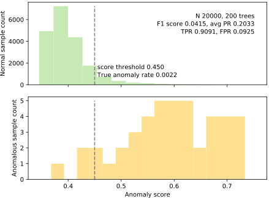
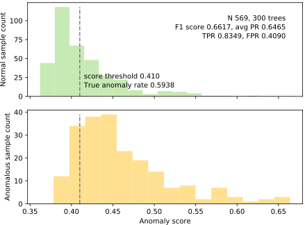
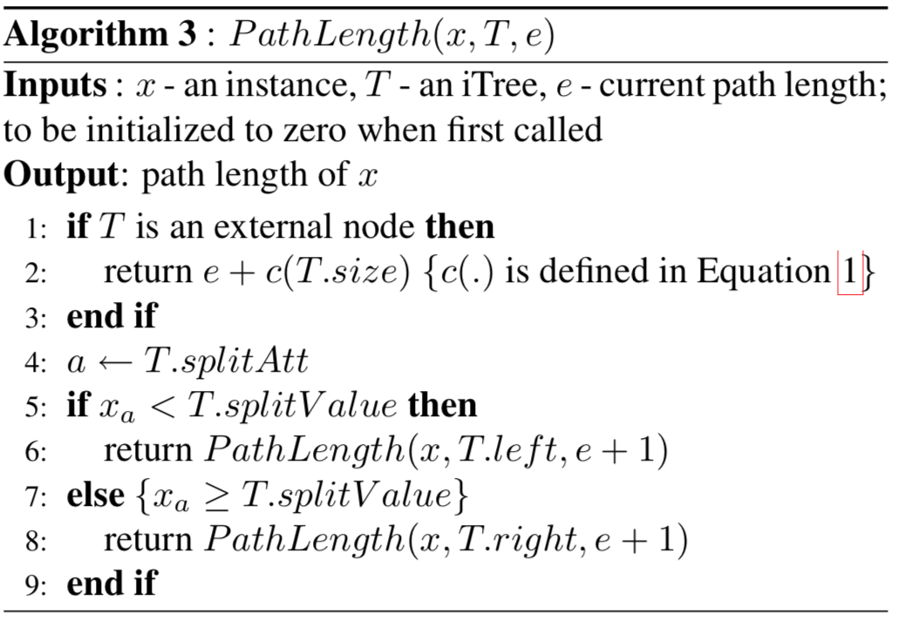

# Isolation Forest Implementation

The goal of this project is to implement the original [Isolation Forest](IsolationForestPaper.pdf) algorithm by Fei Tony Liu, Kai Ming Ting, and Zhi-Hua Zhou as a part of MSDS689 course.  (A later version of this work is also available: [Isolation-based Anomaly Detection](http://citeseerx.ist.psu.edu/viewdoc/download?doi=10.1.1.673.5779&rep=rep1&type=pdf).) There are two general approaches to anomaly detection: 

1. Model what normal looks like and then look for anomalous observations
2. Anomalies are few in quantity and are different which can be easily separable in tree-space.

The isolation forest algorithm is original and beautiful in its simplicity; and also seems to work very well, with a few known weaknesses. The academic paper is extremely readable so you should start there.

## Datasets

This implementation is tested on the following datasets:

* [Kaggle credit card fraud competition data set](https://www.kaggle.com/mlg-ulb/creditcardfraud); download, unzip to get `creditcard.csv`

* Get cancer data into `cancer.csv` by executing [savecancer.csv](https://github.com/parrt/msds689/blob/master/projects/iforest/savecancer.py) that I provide.

* [http.zip](https://github.com/parrt/msds689/blob/master/projects/iforest/http.zip); download, unzip to get `http.csv`.

## Visualization of normal versus anomaly separation

Using [plot_anomalies.py](plot_anomalies.py), we can see the results of the isolation forest trying to detect anomalies. These data sets all have known targets indicating normal versus anomaly, but this information is only used during testing and not during training. 

<table border="0">
<tr><td>http.csv, 200 trees, 99% desired TPR</td></tr>
<tr>
<td border=0>

</tr>
</table>

<table border="0">
<tr><td>creditcard.csv, 200 trees, 80% desired TPR</td><td>creditcard.csv, 200 trees, 90% desired TPR</td></tr>
<tr>
<td border=0>

<td border=0>

</tr>
</table>

<table border="0">
<tr><td> cancer, 300 trees, 70% desired TPR</td><td> cancer, 300 trees, 80% desired TPR</td></tr>
<tr>
<td border=0>

<td border=0>

</tr>
</table>

## Algorithm

The algorithm is based on the idea that the anomalies occur in isolation and it is much easier to separate anomalies using random split in the feature range compared to normal instances. To simplify, anomalies are rare and different which occurs in isolations. The algorithm randomly selects a small subset of observations. Next, we randomly select a feature column and a split value from the selected feature which lies between the min and max values. Note that, the current algorithm only works for continuous features. We keep growing the trees till the termination condition is reached. We repeat the same process and grow a forest to reduce variance. Anomaly score is calculated based on the average path length of each observation across the forest. We normalize the length with the standard height of a binary tree and expect the length of the anomaly to be smaller compared to normal instances. For convenience, here are the algorithms extracted from the Liu *et al* paper:

<table border="0">
<tr>
<td width="50%" valign="top"></td><td width="50%" valign="top"></td>
</tr>
<tr>
<td valign="top">

</td>
<td valign="top">
a different version of average path length is used <tt>c()</tt>, not the one in the original paper: 

Then finally here's the scoring formula: 

where "<i>H(i)</i> is the harmonic number and it can be estimated by <i>ln(i)</i> + 0.5772156649 (Euler’s constant)."
</td>
</tr>
</table>

Note that, we also implement an **improved version** of this algorithm which can handle noisy labels by making the split point unbalanced rather than choosing the split value uniformly from the min and max value. The implementation can be found in [iforest.py](iforest.py)
